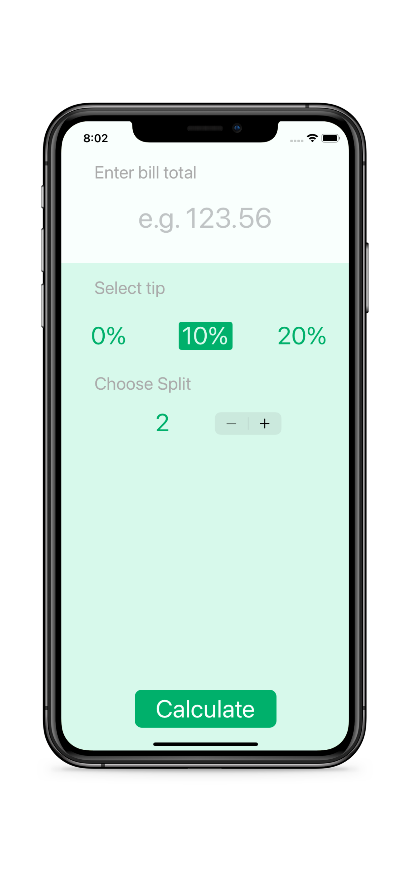
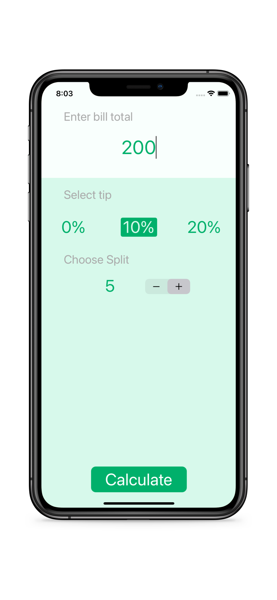
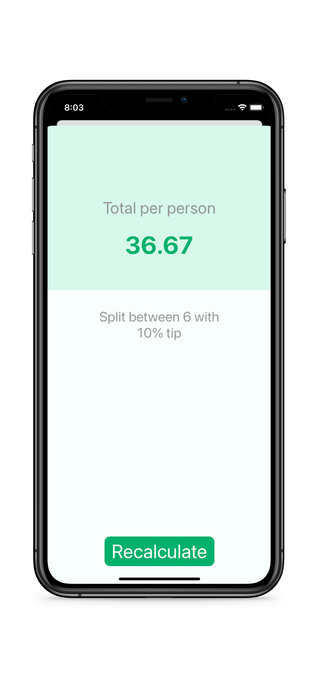

# Tipsy

Tipsy is an app that is able to calculate how much tip you are to give. It allows you to input the total, the tip percentage, and how many payors

## Usage

1. Input the total
1. Tap on the tip percentage
1. Input the total amount of people paying
1. Press Calculate
1. Re-calculate as needed

## Contributing
Pull requests are welcome. For any changes, please open an issue first to discuss what you would like to change.
